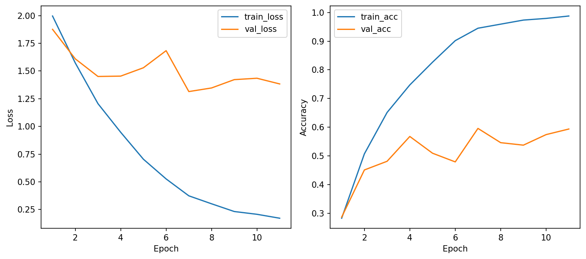
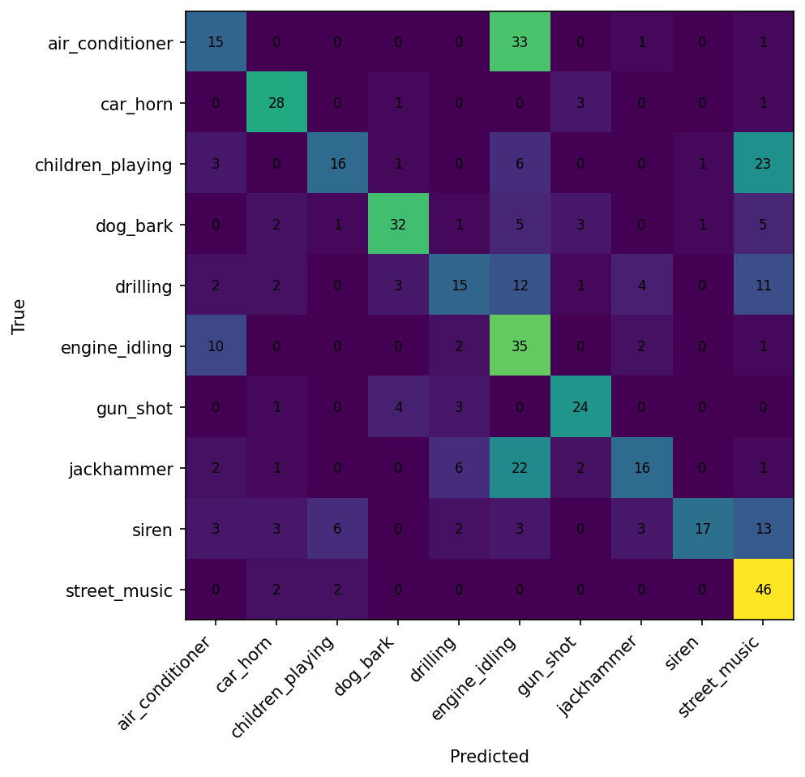

# Báo cáo Lab 3: UrbanSound8K — 1D CNN for Environmental Sound Classification

> **Môn học:** Học sâu (CSC4005)  
> **Họ tên:** Trần Việt Vinh  
> **MSSV:** 1771040030

---

## 1. Giới thiệu bài toán

Bài toán phân loại âm thanh môi trường đô thị (*Environmental Sound Classification*) sử dụng dataset **UrbanSound8K**, gồm **10 lớp âm thanh**:

| STT | Lớp | STT | Lớp |
|-----|-----|-----|-----|
| 1 | `air_conditioner` | 6 | `engine_idling` |
| 2 | `car_horn` | 7 | `gun_shot` |
| 3 | `children_playing` | 8 | `jackhammer` |
| 4 | `dog_bark` | 9 | `siren` |
| 5 | `drilling` | 10 | `street_music` |

---

## 2. Phương pháp

### 2.1 Tiền xử lý dữ liệu

| Tham số | Giá trị |
|---------|---------|
| Sample rate | 16,000 Hz |
| Duration | 4.0 giây |
| Feature type | MFCC |
| n_mfcc | 40 |

### 2.2 Cấu hình tập dữ liệu

| Tập | Folds | Số mẫu |
|-----|-------|--------|
| Train | 1–8 | 1,200 |
| Validation | 9 | 463 |
| Test | 10 | 465 |

### 2.3 Kiến trúc mô hình

- **Input shape:** `[batch_size, 40, time_frames]`  *(n_mfcc × time_frames)*
- **Backbone:** Conv1D → BatchNorm → ReLU → MaxPooling → Dropout *(lặp nhiều block)*
- **Classifier:** Fully Connected → Softmax (10 lớp)
- **Tổng tham số:** 137,930

### 2.4 Hyperparameters

| Tham số | Giá trị |
|---------|---------|
| Optimizer | Adam |
| Learning rate | 0.001 *(giảm khi plateau)* |
| Weight decay | 0.0001 |
| Dropout rate | 0.3 |
| Batch size | 32 |
| Early stopping patience | 5 |
| Epochs thực tế | 11 / 12 |

---

## 3. Kết quả thực nghiệm

### 3.1 Tổng hợp

| Chỉ số | Giá trị |
|--------|---------|
| **Best validation accuracy** | **59.61%** |
| **Test accuracy** | **52.47%** |
| Thời gian trung bình / epoch | 5.14 giây |
| Số lượng tham số | 137,930 |
| Số epochs thực tế | 11 / 12 |

### 3.2 Learning Curves

*Hình 1: Learning curves — train/val loss và accuracy theo epoch*

**Nhận xét:**

- Train accuracy tăng nhanh từ **28.33% → 98.75%** qua 11 epochs.
- Validation accuracy đạt đỉnh **59.61%** tại epoch 7, sau đó không cải thiện.
- Có dấu hiệu **overfitting rõ rệt**: khoảng cách giữa train accuracy (98.75%) và val accuracy (59.40%) ở epoch cuối rất lớn.
- **Early stopping** hoạt động đúng, dừng tại epoch 11.

### 3.3 Confusion Matrix

*Hình 2: Confusion matrix trên tập test*

### 3.4 Kết quả theo từng lớp

| Lớp | Đúng / Tổng | Accuracy | Đánh giá |
|-----|-------------|----------|----------|
| `gun_shot` | 13 / 13 | **100.0%** | ✅ Hoàn hảo |
| `siren` | 31 / 33 | **93.9%** | ✅ Rất tốt |
| `street_music` | 14 / 15 | **93.3%** | ✅ Rất tốt |
| `air_conditioner` | 50 / 59 | 84.7% | ✔ Tốt |
| `car_horn` | 21 / 25 | 84.0% | ✔ Tốt |
| `engine_idling` | 20 / 24 | 83.3% | ✔ Tốt |
| `jackhammer` | 17 / 24 | 70.8% | ⚠ Trung bình |
| `children_playing` | 10 / 14 | 71.4% | ⚠ Trung bình |
| `dog_bark` | 10 / 15 | 66.7% | ⚠ Yếu |
| `drilling` | 11 / 24 | **45.8%** | ❌ Rất yếu |

---

## 4. Phân tích lỗi phân loại

### 🔴 `drilling` — 45.8% (yếu nhất)

| Nhầm sang | Số lần | Giải thích |
|-----------|--------|------------|
| `jackhammer` | 6 | Âm thanh khoan/đục có đặc trưng tần số và nhịp điệu tương tự |
| `gun_shot` | 2 | Cả hai đều có burst năng lượng cao đột ngột |
| `children_playing` | 2 | Tạp âm nền làm nhiễu đặc trưng |

> **Nguyên nhân gốc:** `drilling` và `jackhammer` có phân bố phổ MFCC rất gần nhau, mô hình khó phân biệt chỉ dựa vào 40 hệ số MFCC.

### 🟡 `dog_bark` — 66.7%

| Nhầm sang | Số lần | Giải thích |
|-----------|--------|------------|
| `car_horn` | 3 | Cao độ và nhịp phát âm ngắt quãng tương tự nhau |

### 🟡 `children_playing` — 71.4%

| Nhầm sang | Số lần | Giải thích |
|-----------|--------|------------|
| `siren` | 4 | Âm vực cao và biến động liên tục dễ nhầm với tiếng còi báo động |

---

## 5. So sánh các phương pháp feature extraction

### 5.1 Lý do chọn MFCC làm baseline

| Phương pháp | Ưu điểm | Nhược điểm |
|-------------|---------|------------|
| **MFCC** | Gọn, ổn định, ít tham số, dễ debug | Mất một phần thông tin phổ chi tiết |
| **Log-mel Spectrogram** | Giữ nhiều thông tin phổ hơn | Kích thước lớn hơn, dễ bị nhiễu hơn |
| **Raw Waveform** | Không mất thông tin, nguyên bản | Chiều dữ liệu rất cao (~64,000 điểm), cần nhiều dữ liệu và tài nguyên |

### 5.2 Kết luận lựa chọn

**MFCC + 1D-CNN là lựa chọn phù hợp** trong khuôn khổ lab này vì:
- Chạy ổn định trên máy sinh viên (~5.14 giây/epoch).
- Đạt kết quả chấp nhận được (52.47% test accuracy).
- Pipeline đơn giản, dễ tái hiện và phân tích lỗi.

---

## 6. Kết luận

### 6.1 Kết quả đạt được

- ✅ Pipeline tiền xử lý audio hoạt động ổn định từ đầu đến cuối.
- ✅ Mô hình MFCC + 1D-CNN hội tụ tốt, early stopping hoạt động đúng.
- ✅ Đã log đầy đủ metrics lên W&B, có thể tái hiện kết quả.
- ✅ Xác định được lớp mạnh (`gun_shot`, `siren`) và lớp yếu (`drilling`).

### 6.2 Hạn chế & hướng cải thiện

| Hạn chế | Hướng cải thiện |
|---------|----------------|
| Overfitting (train 98.75% vs val 59.40%) | Tăng dropout, giảm số filters, thêm regularization |
| Test accuracy còn thấp (52.47%) | Data augmentation (time shift, pitch shift, add noise) |
| MFCC mất thông tin phổ | Thử Log-mel Spectrogram + 2D-CNN |
| Tập train nhỏ (1,200 mẫu) | Dùng toàn bộ folds 1–8 (~7,079 mẫu) |

### 6.3 Best model

| Thông tin | Giá trị |
|-----------|---------|
| Kiến trúc | MFCC + 1D-CNN |
| Best val accuracy | 59.61% |
| Test accuracy | **52.47%** |

---

## 7. Trả lời câu hỏi tự kiểm tra

**1. Vì sao cần đưa audio về cùng sample rate?**  
Để đảm bảo tất cả file có cùng số điểm tín hiệu trên mỗi giây, giúp MFCC và các features khác có cùng đơn vị thời gian, mô hình học nhất quán hơn.

**2. Vì sao cần pad/crop audio về cùng độ dài?**  
Để tạo tensor đầu vào có kích thước đồng nhất `[batch_size, n_mfcc, time_frames]`, điều kiện bắt buộc để batch processing trong PyTorch/TensorFlow.

**3. MFCC là gì trong pipeline của bài lab này?**  
MFCC (*Mel-frequency Cepstral Coefficients*) là bộ đặc trưng tóm tắt phổ âm thanh theo thang tần số Mel — gần với cách tai người cảm nhận âm thanh. Trong lab, MFCC được dùng làm đầu vào cho 1D-CNN thay vì tín hiệu thô.

**4. Input của MFCC + 1D-CNN có shape như thế nào?**  
`[batch_size, n_mfcc, time_frames]` = `[batch_size, 40, time_frames]`. Conv1D xử lý mỗi hàng MFCC như một "kênh", trượt dọc theo chiều thời gian.

**5. Conv1D đang trượt theo chiều nào?**  
Trượt dọc theo **trục thời gian** (`time_frames`), học các mẫu cục bộ trong chuỗi âm thanh (pattern ngắn hạn).

**6. Vì sao cấu hình chính dùng MFCC thay vì raw waveform?**  
Raw waveform có chiều rất cao (~64,000 điểm cho 4 giây), mô hình phải học từ tín hiệu thô không có cấu trúc rõ ràng, cần nhiều dữ liệu và dễ bị nhiễu. MFCC đã nén thông tin quan trọng xuống còn 40 hệ số, phù hợp với tài nguyên tính toán của lab.

**7. Dấu hiệu nào cho thấy mô hình bị overfitting?**  
Train accuracy rất cao (98.75%) trong khi validation accuracy thấp hơn nhiều (59.40%), kèm theo val loss dao động hoặc bắt đầu tăng sau epoch 7 dù train loss vẫn giảm.

**8. Confusion matrix giúp phát hiện điều gì?**  
Giúp xác định lớp nào có hiệu quả tốt, lớp nào hay bị nhầm và nhầm sang lớp nào — từ đó có thể cải thiện mô hình có định hướng (ví dụ: tăng cường dữ liệu cho lớp `drilling` và `jackhammer`).

**9. W&B giúp ích gì khi so sánh nhiều cấu hình?**  
W&B tự động log tất cả metrics theo từng epoch, vẽ learning curves, cho phép so sánh nhiều runs trên cùng một dashboard. Giúp đưa ra quyết định dựa trên số liệu thay vì cảm tính.

**10. Nếu raw waveform có kết quả thấp hơn MFCC, có thể giải thích thế nào?**  
Raw waveform yêu cầu mô hình tự học cách trích xuất đặc trưng từ ~64,000 điểm tín hiệu thô. Với dataset nhỏ (~1,200 mẫu) và mô hình không quá sâu, mô hình chưa đủ khả năng học được các pattern phức tạp từ tín hiệu thô, dẫn đến kết quả kém hơn MFCC.

---

## 8. W&B Dashboard

| | Link |
|-|------|
| **Project** | [csc4005-lab3-urbansound-1dcnn](https://wandb.ai/vinhtran2785-bt/csc4005-lab3-urbansound-1dcnn) |
| **Run** | [h3ehkdo7](https://wandb.ai/vinhtran2785-bt/csc4005-lab3-urbansound-1dcnn/runs/h3ehkdo7) |

> ⚠️ Cần đăng nhập tài khoản `vinhtran2785` để xem dashboard.

---

*Báo cáo được hoàn thành dựa trên kết quả thực nghiệm từ baseline MFCC + 1D-CNN trên tập UrbanSound8K.*